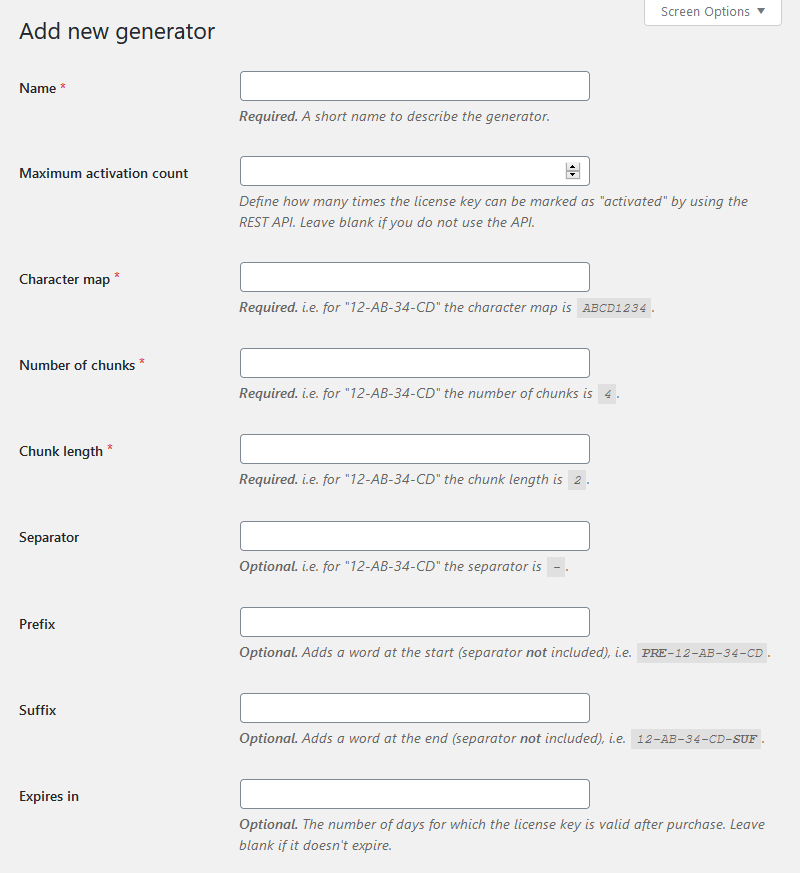

Navigate to the **License Manager** → **Generators** page and click the “**Add
new**” button at the top of the page. You will be redirected to the form.
Please read the description of every field, so that you understand how each one
of them affects the license key.

The "Add generator" form

