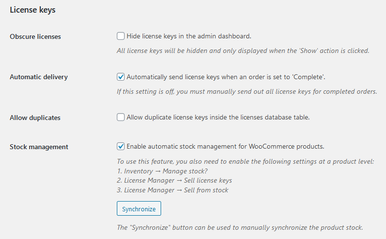
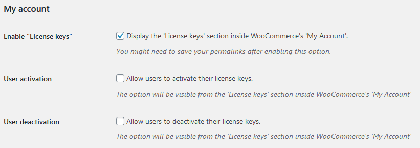
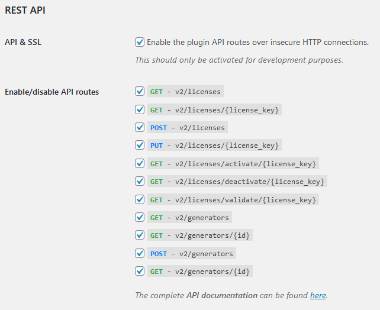

The general settings tab is divided into three sections: License keys, My account, and REST API.

## License keys

The "license keys" settings section

The “**Obscure licenses**” setting allows the user to configure whether license keys will be hidden in the administrator
interface (backend), to prevent anyone from taking a direct look at the plain-text, decrypted license keys.

The “**Automatic delivery**” setting determines whether license keys will be automatically delivered after the order
delivery is triggered. This is great if you want to run manual checks on the orders before sending out your licenses,
however in most scenarios you will probably want to have this setting turned on.

The “**Allow duplicates**” setting allows the user to add duplicate license keys to the database. When adding a license
key, the plugin will no longer check if said license key is already present inside the database.

## My account

The “My Account” settings section

The “**Enable ‘License keys’**” setting allows the user to determine whether the “License keys” section will be displayed
for the customers inside their “My account” page.

The “**User activation**” setting allows the user to determine whether the customers should be able to activate their
license keys from the “My account” page.

The “**User deactivation**” setting allows the user to determine whether the customers should be able to deactivate their
license keys from the “My account” page.

## REST API

The “REST API” settings section

The “**API & SSL**” setting determines whether the REST API will be accessible over insecure HTTP connections, instead of
the secure HTTPS channel. This should only be used in development or testing/staging environments, never in a
productive setting. Leaving this setting on, on a productive website, exposes your API calls to man-in-the-middle attacks.

The “**Enable/disable API routes**” setting allows the user to individually enable and disable API routes. Always turn off
the REST API routes which your application does not use.
