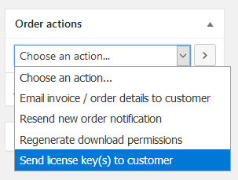

If you had to edit or replace the license keys for an existing order you can
easily email the customer their new license keys. When editing an order, check
out the “**Send license key(s) to customer**” order action on the right-hand
side of the screen, as shown below.

License keys sold by a WooCommerce order are displayed inside the order itself

