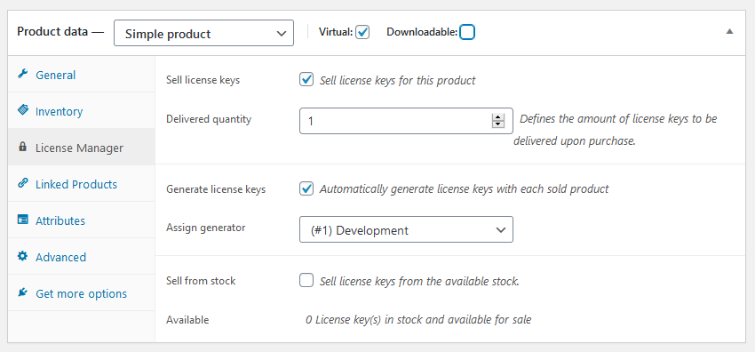

While editing a simple WooCommerce product, a new data tab inside the product
data box will appear. This tab lets you do the following:

 - Set the product to sell license keys
 - Set the amount of license keys to be delivered upon purchase
 - Choose whether to use a generator or not
 - Assign a previously created generator to the product
 - Choose whether to sell license keys from the available stock
 - View the available stock amount

The new “License Manager” WooCommerce product data tab and its options

