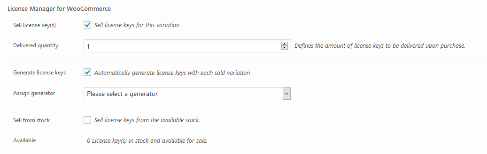

The same options for simple products will also appear for each variation of a
variable product. Clicking the “**Variations**” tab will display the currently
available product variations, simply expand the variation you wish to edit and
scroll a bit down, you’ll find a “**License Manager for WooCommerce**” section
as show below.

The “License Manager for WooCommerce” options for variable products

