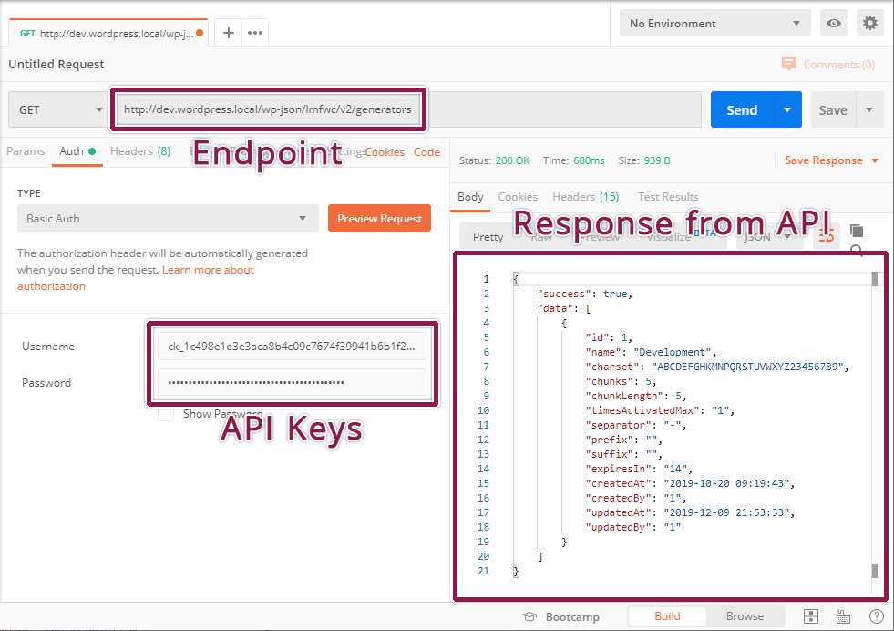

## Making a basic request

The request URL we’ll test is `wp-json/lmfwc/v2/generators`. On localhost the
full URL may look something like this: `http://dev.wordpress.local/wp-json/lmfwc/v2/orders`.
Modify this to use your own site URL.

In Postman, you need to set the fields for request type, request URL, and the
settings on the authorization tab. For Authorization, choose basic auth and
enter your consumer key and consumer secret keys from the License Manager for
WooCommerce into the username and password fields.

Once you're done, hit send, and you’ll see the JSON response from the API if
everything went well. The response should look like this:

POSTMAN window

That's it! The API is working.

If you have problems connecting, you may need to disable SSL verification – see the connection issues section below.

## 401 Unauthorized

Your API keys or signature is wrong. Ensure that:

 - The user you generated API keys for actually has access to those resources.
 - The username when authenticating is your consumer key.
 - The password when authenticating is your consumer secret.
 - Make a new set of keys to be sure.

If your server utilizes FastCGI, check that your <a href={"https://support.metalocator.com/en/articles/1654091-wp-json-basic-auth-with-fastcgi"} target={"_blank"} rel={"noopener noreferrer"}>authorization headers are properly read</a>.

## Consumer key is missing

If you are receiving the 403 HTTP status, coupled with the
`lmfwc_rest_no_ssl_error` error message, the plugin is refusing the request
because you are not using a secure (SSL) connection. You can use the plugin
settings to allow the REST API to function on insecure HTTP connections. To do
so, go to **License Manager** > **Settings**

> Do not disable this setting on a productive environment. Allowing the REST
API to be used on insecure connections will expose your license keys to
Man-in-the-Middle attacks.
